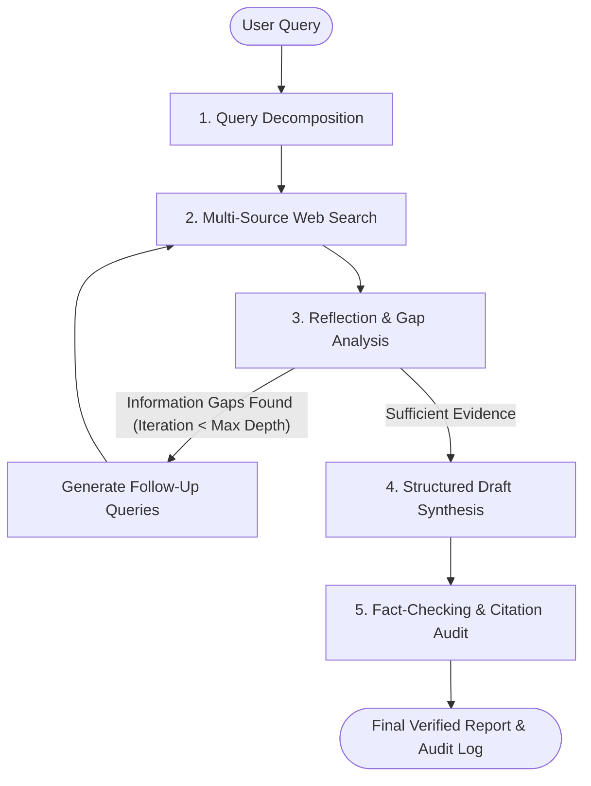

# Autonomous Deep Research Agent

An autonomous research system built with LangGraph, LangChain, and Tavily Search. The agent decomposes user research queries into targeted sub-queries, performs recursive web investigations with self-reflection and gap analysis, and executes automated citation verification to eliminate factual hallucinations.

Author: Vikas Joshi (vikasjoshi.2027@gmail.com)

---

## Architecture & Workflow



---

## Key Features & Capabilities

- **Autonomous Query Decomposition**: Analyzes ambiguous or broad topics and extracts targeted sub-queries addressing background, technical breakthroughs, and limitations.
- **Recursive Gap Analysis & Self-Correction**: An evaluation node audits retrieved evidence and dynamically triggers follow-up searches if critical information gaps exist.
- **URL Deduplication**: Automatically aggregates and deduplicates search findings across search iterations.
- **Citation Verification Node**: Cross-references claims against raw retrieved source content to ensure factual fidelity and prevent hallucinations.
- **Dual Interface**: Full support for headless CLI execution and an interactive Streamlit web dashboard.

---

## Installation & Setup

### Prerequisites
- Python 3.10 or higher
- OpenAI API Key
- Tavily Search API Key

### 1. Clone Repository & Install Dependencies
```bash
git clone <your-repo-url>
cd web-research-agent
pip install -r requirements.txt
```

### 2. Configure Environment Variables
Copy the template configuration file to `.env`:
```bash
cp .env.example .env
```

Configure your API credentials in `.env`:
```env
OPENAI_API_KEY=your_openai_api_key_here
TAVILY_API_KEY=your_tavily_api_key_here
OPENAI_MODEL=gpt-4o-mini
```

---

## Usage

### Option A: Streamlit Web Dashboard
Launch the interactive web dashboard:
```bash
streamlit run app.py
```

### Option B: Command-Line Interface (CLI)
Execute research tasks directly from the terminal:

```bash
# Run with default query
python agent.py

# Run with custom query and iteration depth
python agent.py --query "State of multi-agent orchestration architectures in 2026" --max-iterations 2
```

---

## Project Structure

```
web-research-agent/
├── app.py              # Streamlit web dashboard
├── agent.py            # LangGraph cyclic state graph and core execution engine
├── requirements.txt    # Project dependencies
├── metadata.yaml       # Project configuration and metadata
├── .env.example        # Environment variable template
├── .gitignore          # Git ignore rules
├── LICENSE             # MIT License
└── README.md           # Technical documentation
```

---

## Technical Overview

- **StateGraph Architecture**: Built with LangGraph StateGraph to coordinate cyclical evaluation loops, state persistence, and conditional transitions.
- **Bounded Recursion**: Configurable recursion guards (`max_iterations`) ensure deterministic termination and cost control.
- **Source Verification**: Adversarial audit step validates that cited claims strictly correspond to source snippets.

---

## Author

- **Vikas Joshi** (vikasjoshi.2027@gmail.com)

---

## License

This project is open-source and available under the [MIT License](LICENSE).